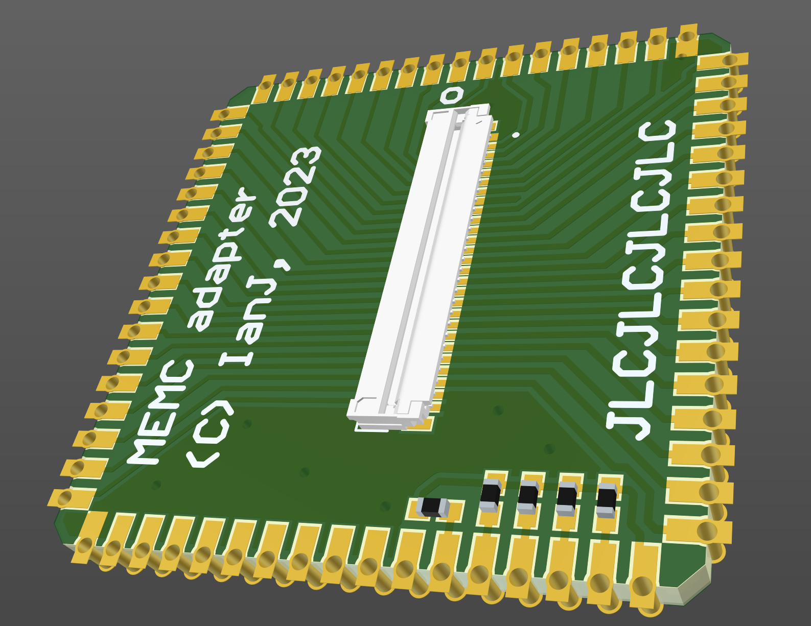

# MEMC to FFC adapter

April 2023

This project replaces an Acorn MEMC with a small PCB which routes the MEMC control signals to the new board.  It's implemented in such a way that it can be populated on to the A3010 Adelaide Heron daughter card whilst also replacing the ARM2 with a socket to support ARM3 -- it was necessary to implement this way, because there is no room on the Heron card to fit both a socket for MEMC alongside a socket for ARM3.   This solution also resolves any issue with height clearance issues above MEMC - a 'traditional' dual-MEMC board wouldn't physically fit here due to the limited height clearance available.

Note that the RAM address and control lines are not routed via the FFC, so any "on board" memory will be unused with this adapter.

The design has not yet been built / tested.

## Licence

No warranty is provided, and this work is used at your own risk.  

Licenced as CC BY-SA 3.0

Copyright 2023 Ian Jeffray

